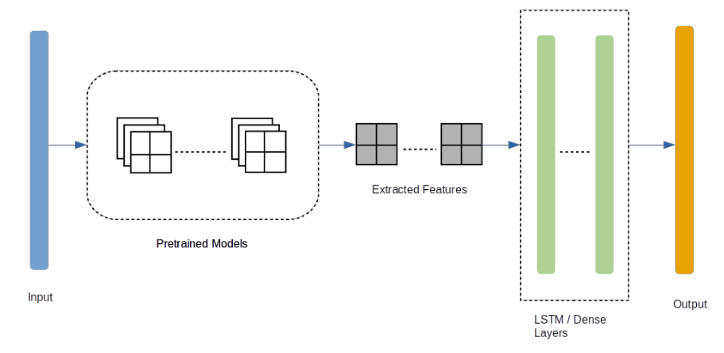

# Violence Detection by Pretrained Modules with Different Deep Learning Approaches

### Abstract

In this paper, we have explored different strategies to find out the saliency of the features from different pretrained models in detecting violence in videos. A dataset has been created which consists of violent and non-violent videos of different settings. Three ImageNet models; VGG16, VGG19, ResNet50 are being used to extract features from the frames of the videos. In one of the experiments, the extracted features have been feed into a fully connected network which detects violence in frame level. Moreover, in another experiment, we have fed the extracted features of 30 frames to a long short-term memory (LSTM) network at a time. Furthermore, we have applied attention to the features extracted from the frames through spatial transformer network which also enables transformations like rotation, translation and scale. Along with these models, we have designed a custom convolutional neural network (CNN) as a feature extractor and a pretrained model which is initially trained on a movie violence dataset. In the end, the features extracted from the ResNet50 pretrained model proved to be more salient towards detecting violence. These ResNet50 features, in combination with LSTM provide an accuracy of 97.06% which is better than the other models we have experimented with.

> <b>Journal Paper Link</b> - https://www.worldscientific.com/doi/abs/10.1142/S2196888820500013

### Rudimentary Structure



### Datasets
```
Raw Video - https://drive.google.com/file/d/1b3P8D5obY8ETsCaOaKL5lktYr4gMtLVz/view?usp=sharing
Processed Dataset - https://drive.google.com/file/d/1mavruIzCGVE949ZEt1F1sEG5s16tfVz-/view?usp=sharing
```
